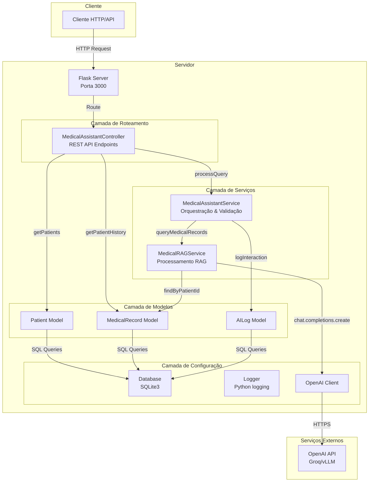
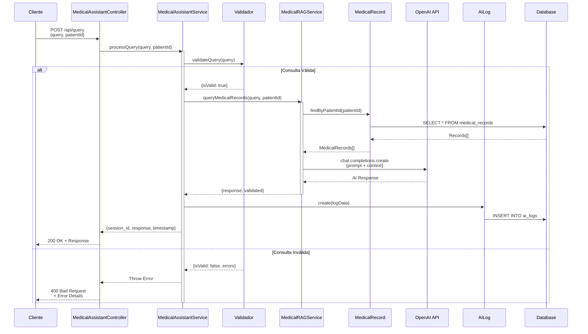

# 🏥 Assistente Médico Inteligente

Sistema de apoio clínico desenvolvido em **Python** para auxiliar profissionais de saúde na análise de prontuários e tomada de decisões baseadas em evidências.

## 🎯 Objetivo

Este projeto foi criado para fornecer suporte inteligente a médicos e profissionais de saúde, permitindo consultas rápidas e precisas sobre histórico de pacientes através de uma interface simples e segura.

## 🛠️ Stack Tecnológico

- **Backend**: Python + Flask
- **Banco de Dados**: SQLite3
- **IA**: OpenAI API
- **RAG**: Retrieval-Augmented Generation
- **Validação**: Security Layer customizada

## 📋 Pré-requisitos

- Python 3.10+
- pip
- API Key da OpenAI

## 🚀 Instalação

1. Clone o repositório:
```bash
git clone <repository-url>
cd autonomous-medical-robot
```
2. Instale as dependências:
```bash
pip install -r requirements.txt
```

3. Configure as variáveis de ambiente:
```bash
cp .env.example .env
# Edite o arquivo .env com sua API key
```

4. Inicie o servidor:
```bash
python app.py
```

## 📡 Endpoints

Curls disponíveis no arquivo `postman-collection.json`

### POST /api/query
Processa consultas médicas usando RAG com dados do paciente.

### GET /api/patients
Lista todos os pacientes cadastrados.

### GET /api/analytics
Retorna estatísticas de uso do sistema.

## 🏗️ Arquitetura

```
src/
├── config/
│   ├── database.py       # Conexão SQLite3
│   ├── logger.py         # Sistema de logs
│   └── __init__.py
├── controllers/
│   └── medical_assistant_controller.py
├── services/
│   ├── medical_assistant_service.py
│   ├── rag_service.py
│   └── __init__.py
├── models/
│   ├── patient.py
│   ├── medical_record.py
│   ├── ai_log.py
│   └── __init__.py
└── routes/
    └── __init__.py
```

---

# 📐 Diagrama de Arquitetura - Autonomous Medical Robot

## Visão Geral do Sistema




## Fluxo de Processamento de Consulta



## Arquitetura em Camadas

```
┌─────────────────────────────────────────────────────────────┐
│                    CAMADA DE APRESENTAÇÃO                    │
│  ┌─────────────────────────────────────────────────────────┐│
│  │                   Flask Server                            ││
│  │  • Routes (api_routes)                                  ││
│  │  • Middleware (CORS, Security Headers)                   ││
│  └─────────────────────────────────────────────────────────┘│
└─────────────────────────────────────────────────────────────┘
                              ↓
┌─────────────────────────────────────────────────────────────┐
│                    CAMADA DE CONTROLE                        │
│  ┌─────────────────────────────────────────────────────────┐│
│  │         MedicalAssistantController                      ││
│  │                                                         ││
│  │  • POST /api/query          → processQuery()           ││
│  │  • GET  /api/patients       → getPatients()            ││
│  │  • GET  /api/patients/:id   → getPatientById()         ││
│  │  • GET  /api/patients/:id/history → getPatientHistory() ││
│  │  • GET  /api/analytics      → getSystemAnalytics()      ││
│  └─────────────────────────────────────────────────────────┘│
└─────────────────────────────────────────────────────────────┘
                              ↓
┌─────────────────────────────────────────────────────────────┐
│                    CAMADA DE SERVIÇOS                       │
│  ┌─────────────────────┐    ┌─────────────────────────────┐│
│  │MedicalAssistantService│   │      MedicalRAGService      ││
│  │                     │    │                             ││
│  │• processQuery()     │    │• queryMedicalRecords()      ││
│  │• validateQuery()    │───→│• searchSimilarRecords()     ││
│  │• processWithRAG()   │    │                             ││
│  │• logInteraction()   │    │                             ││
│  │• getSessionHistory()│    │                             ││
│  └─────────────────────┘    └─────────────────────────────┘│
└─────────────────────────────────────────────────────────────┘
                              ↓
┌─────────────────────────────────────────────────────────────┐
│                    CAMADA DE MODELOS                         │
│  ┌──────────────┐  ┌──────────────────┐  ┌──────────────┐  │
│  │   Patient    │  │  MedicalRecord   │  │   AILog      │  │
│  │              │  │                  │  │              │  │
│  │• findAll()   │  │• create()        │  │• create()    │  │
│  │• findById()  │  │• findById()      │  │• findBySession│  │
│  │• search()    │  │• findByPatientId()│ │• findByPatient│  │
│  │• create()    │  │• update()        │  │• getAnalytics│  │
│  │• update()    │  │• delete()        │  │              │  │
│  │• delete()    │  │• search()        │  │              │  │
│  └──────────────┘  └──────────────────┘  └──────────────┘  │
└─────────────────────────────────────────────────────────────┘
                              ↓
┌─────────────────────────────────────────────────────────────┐
│                    CAMADA DE DADOS                           │
│  ┌──────────────┐  ┌──────────────┐  ┌──────────────┐       │
│  │   Database   │  │    Logger    │  │   OpenAI     │       │
│  │   SQLite3    │  │   Python     │  │    Client    │       │
│  │              │  │   logging    │  │              │       │
│  │• connect()   │  │• info()      │  │• chat.completions│    │
│  │• close()     │  │• error()     │  │   .create()  │       │
│  │• get()       │  │• warn()      │  │              │       │
│  │• all()       │  │              │  │              │       │
│  │• run()       │  │              │  │              │       │
│  └──────────────┘  └──────────────┘  └──────────────┘       │
└─────────────────────────────────────────────────────────────┘
```

## Componentes Principais

| Componente | Responsabilidade | Tecnologia |
|------------|-------------------|------------|
| **Flask Server** | HTTP Server, Routing | Flask 3.x |
| **MedicalAssistantController** | API Endpoints, Request/Response handling | Python 3 |
| **MedicalAssistantService** | Business Logic, Query Validation | Python 3 |
| **MedicalRAGService** | RAG Processing, OpenAI Integration | Python 3 + OpenAI |
| **Patient Model** | Patient CRUD Operations | SQLite3 |
| **MedicalRecord Model** | Medical Records CRUD | SQLite3 |
| **AILog Model** | Audit Logging & Analytics | SQLite3 |
| **Database** | Data Persistence | SQLite3 |
| **Logger** | Application Logging | Python logging |

## Fluxo de Dados

1. **Entrada**: Cliente envia requisição HTTP para endpoint da API
2. **Roteamento**: Flask direciona para MedicalAssistantController
3. **Validação**: MedicalAssistantService valida a consulta (tamanho, conteúdo proibido)
4. **Processamento**: Se válida, MedicalRAGService busca registros relevantes
5. **Enriquecimento**: Contexto médico é preparado para o prompt
6. **IA**: OpenAI API gera resposta baseada no contexto
7. **Logging**: Interação é registrada em AILog para auditoria
8. **Resposta**: Resultado é retornado ao cliente com metadata

---

## 📊 Funcionalidades

### RAG
Sistema de busca direta no banco de dados por paciente ID, sem necessidade de embeddings complexos. Mais rápido e eficiente para consultas específicas.

### Sistema de Logs
Todas as interações são registradas com:
- Session ID
- Patient ID  
- Query e Response
- Tempo de resposta
- Fontes utilizadas

### Validação Inteligente
O sistema valida consultas para evitar:
- Solicitações de prescrição
- Perguntas sobre dosagem
- Tentativas de diagnóstico definitivo
- Injeção de SQL

## 🧪 Testes

Os testes estão disponíveis no arquivo `postman-collection.json`.

## 📝 Logs

O sistema utiliza Python logging para logs estruturados:
- Níveis: info, warn, error
- Saída: console + arquivo
- Metadados completos

## ⚠️ Aviso Importante

Este sistema foi desenvolvido como projeto acadêmico do curso de Pós-Graduação da FIAP e tem fins exclusivamente educacionais. **NÃO substitui** o julgamento clínico de profissionais qualificados. Todas as decisões médicas devem ser tomadas por profissionais de saúde qualificados.
